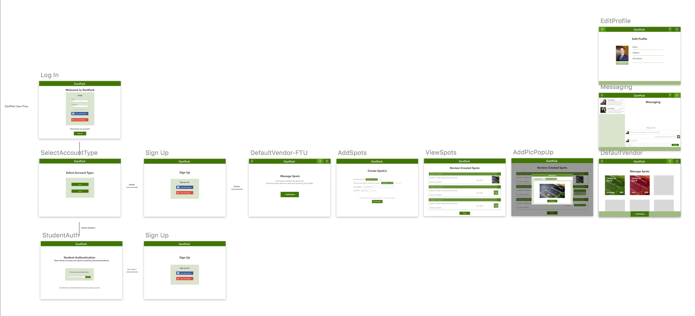
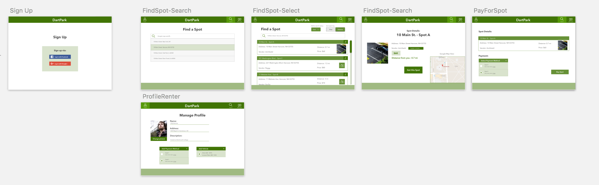

# DartPark - front end
## Authors: Mau Esquivel, Jessie Anderson, Luisa Vasquez, Ben Cooper, Divya Kalidindi

### The App
DartPark is an application that allows users to buy and sell parking spots in and around Dartmouth’s campus. The front end provides a simple, user-friendly interface where renters can search for and buy parking spots based on location, and vendors can list spots with a location, description, and price. The app implements a Google Search Box API, which matches a search query with available locations, and also allows for messaging between renters and vendors. Additionally, payment is supported with the Braintree payment API.

### Usage
#### Installation:
`npm install`
#### Deployment:
  deployed using surge at http://dartpark.surge.sh/

#### Components and Models

##### Renter Model
The main components of the renter model included:
- Search Bar: implemented Google Maps API to filter and store a valid location
- Spot Detail: organized information about spots including price, location, and vendors, as well as being editable to include images of the spot
- Search Spots: based on a specific query, allows for a display of spots populated by the database
- Profile: includes basic information about renter as well as payment and vehicle details
- Payment: [Braintree](https://github.com/braintree)

##### Vendor model
The main components of the vendor model included:
- Create Spots: vendor can create and customize spots based on location and price
- Edit Spots: allows for the ability to change information of spots at any time
- Manage Spots: a real time view of the status of all vendor spots
- Profile: includes basic details about vendor and contact information

##### Shared components
- Messaging between renter and vendor
- Sign in/sign up
- Authentication using [Passport](https://github.com/jaredhanson/passport)

#### What Worked!
- Successful implementation of Braintree API
- Conversation messaging between renter and vendor
- Google Autocorrect Search Bar for valid locations

#### What Didn't Work
1. Web Authentication for Dartmouth students: as of now, the app allows any individual to become a renter or vendor; ideally, Dartmouth students can only rent spots.
2. Email verification: In the future, we could change the user schema to include a check for a verified email. This would be useful in ensuring that each email has been validated before allowing users to create an account and sign in. (Perhaps look more into [SendGrid](https://github.com/sendgrid/sendgrid-nodejs) example to send verification codes to inputed emails).
3. Error handling/Better UI Experience: As of now, the app does not verify input type, so errors can potentially arise when sending wrong information to the backend (i.e. letters when inputing price). Additionally, errors occurring in the backend do not display for the user, so in the future, we would like to work on a more efficient user interface where notifications of errors are more apparent.
4. Advanced filtering: Being able to sort by price, distance, and vendor in addition to location
5. Photo upload (see below)

#### Photos
- In implementing a photo uploading system, we used two libraries/systems.  The first, [`dropzone.js`](http://www.dropzonejs.com/) and the second, [`Cloudinary`](http://cloudinary.com/).  **Dropzone** is used to transfer the photo from the computer to the local webpage, and **Cloudinary** is used to take the local file and store it on their database.
- In attempting this system, the following tutorials were used:
  - [Cloudinary Node.js](http://cloudinary.com/documentation/node_integration#getting_started_guide)
  - [CSS Tricks](https://css-tricks.com/image-upload-manipulation-react/)

#### Payment

**Original Flow Charts**

Vendor

Renter

## Acknowledgments

Thanks, Tim!

